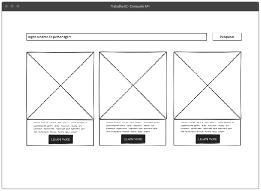

# 🚀 Projeto Front-End – Consumo de API com JavaScript

## 📚 Sobre o Projeto

Descreva o que o seu projeto faz, qual API foi utilizada e quais funcionalidades foram implementadas.

---

## 🛠️ Tecnologias Utilizadas

- HTML
- CSS
- JavaScript (Vanilla JS)

---

## 🔗 Acesse o Projeto

- 💻 GitHub: [COLE AQUI O LINK DO REPOSITÓRIO]
- 🌐 GitHub Pages: [COLE AQUI O LINK DO DEPLOY]

---

## 📢 Publicação no LinkedIn

👉 [COLE AQUI O LINK DO POST NO LINKEDIN]

## Autor
Nome do aluno: [link de alguma rede social]